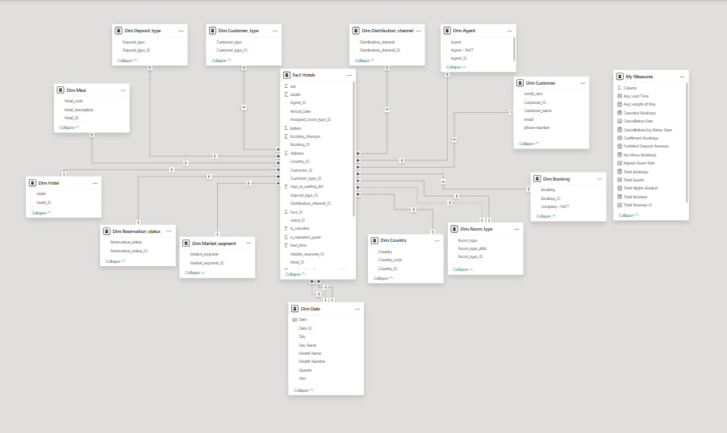
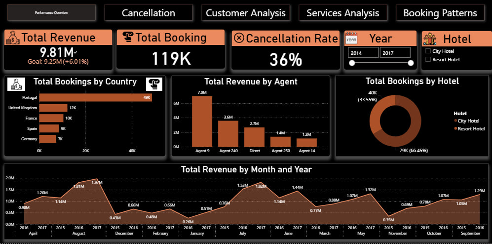
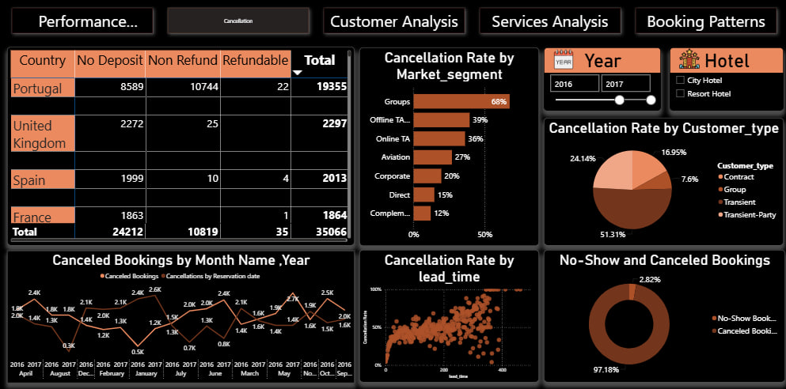
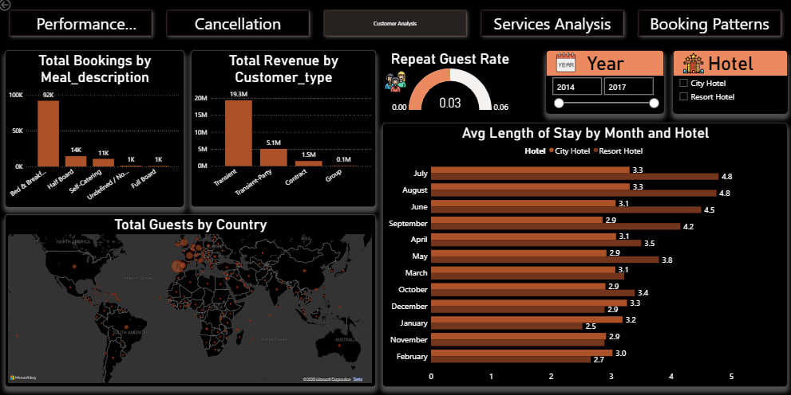
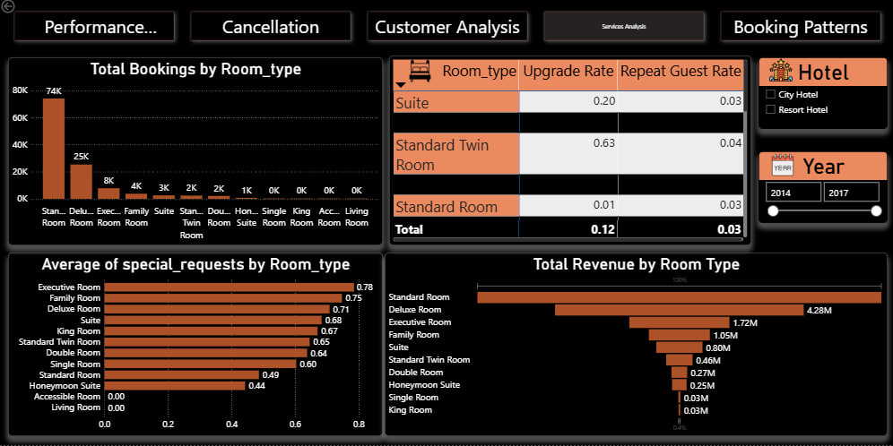
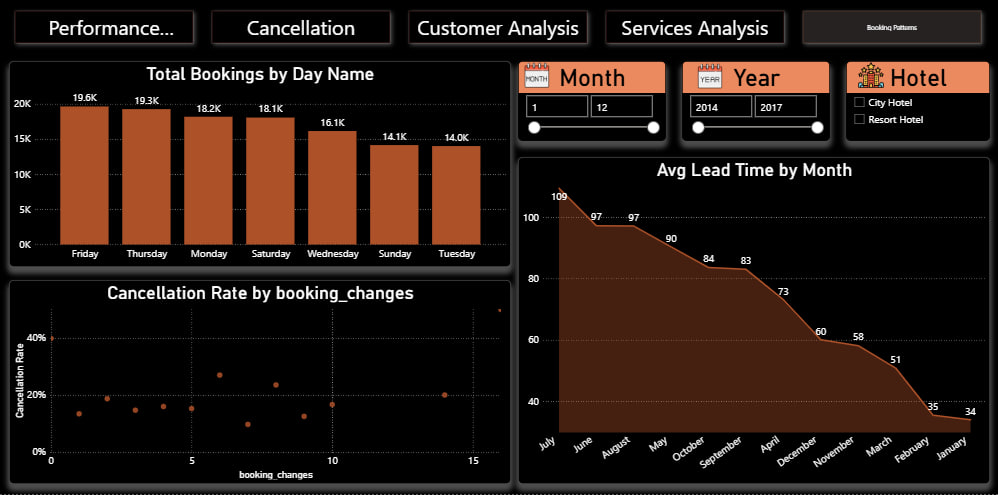

# Hotel Booking Analysis Dashboard using Power BI

## Project Overview

This project is an end-to-end business intelligence solution designed to analyze a comprehensive hotel booking dataset. The goal is to transform raw, complex data into a dynamic, interactive 5-page Power BI dashboard. This dashboard provides actionable insights into booking patterns, customer behaviors, and cancellation drivers, enabling strategic decision-making to enhance revenue and operational efficiency for two hotel types: a City Hotel and a Resort Hotel.

---

## Data Source

The analysis is based on a single CSV file: `hotels.csv`.
- **Dataset Size:** Approximately 119,000 booking records.
- **Attributes:** 32 original columns.
- **Time Frame:** July 2015 to August 2017.

---

## Tools Used

- **Power BI:** The primary tool for the entire project.
  - **Power Query:** For all ETL (Extract, Transform, Load) processes.
  - **DAX (Data Analysis Expressions):** For creating calculated columns and advanced measures.
  - **Data Modeling:** For building a robust data model.

---

## Project Methodology

The project followed a structured BI workflow from data cleaning to final visualization.

### 1. Data Cleaning and Transformation (ETL)

Executed in Power Query, this crucial phase involved:
- **Handling Nulls:** Replaced null values in numeric columns like `children` and `adr` with `0`.
- **Key Creation:**
  - **`BookingID`:** An index column was added to the fact table to serve as a unique primary key for each booking.
  - **`CustomerID`:** A unique surrogate key was engineered for each customer using their `email` to solve the issue of duplicate names.
  - **Numeric Date Keys:** Date columns (`arrival_date`, `reservation_status_date`) were transformed into numeric keys in the `YYYYMMDD` format for optimized model performance.
- **Data Integrity:** Removed sensitive and unnecessary PII (Personally Identifiable Information) columns like `name`, `email`, and `phone-number` from the fact table after creating the customer dimension.

### 2. Data Modeling

A professional **Star Schema** was designed and implemented to ensure the model is efficient, scalable, and easy to analyze.
- **1 Fact Table:** `Fact_Hotels` containing all quantitative data and foreign keys.
- **13 Dimension Tables:** `dim_date`, `dim_customer`, `dim_hotel`, `dim_agent`, `dim_country`, and others that provide descriptive context to the fact table.
- **Relationships:**
    - All dimensions are linked to the fact table with one-to-many relationships.
    - An inactive relationship was established with the `dim_date` table on the `reservation_status_date_id` to enable advanced analysis of cancellations over time.
      
*Data Modeling*

### 3. DAX Measures

Over 20 advanced DAX measures were created to power the dashboard's visuals and provide deep insights. Key measures include:
- **KPIs:** `Total Revenue`, `Total Bookings`, `Cancellation Rate`, `No-Show Rate`, `Total Guests`.
- **Time Intelligence:** `Total Revenue LY` (Last Year) and `Revenue YoY %` (Year-over-Year Growth).
- **Advanced Analytics:** `Cancellations by Status Date` (using `USERELATIONSHIP`) to analyze when cancellations actually occurred.

---

## Dashboard & Key Insights

The final output is an interactive 5-page dashboard, where each page tells a part of the story.

- **Page 1: Overview**
  A high-level summary showing a total revenue of **$11.6M** from **119K bookings**. It highlights that the City Hotel accounts for **66.4%** of bookings and identifies the top 5 source countries.

- **Page 2: Customer Analysis**
  Reveals that **47.4%** of bookings come from **Online Travel Agents (TAs)** and that `Transient` customers are the largest segment.

- **Page 3: Cancellation Analysis**
  A key finding from this page is that bookings with **"No Deposit" have a significantly higher cancellation rate**, providing a critical insight for revising booking policies.

- **Page 4: Booking Patterns**
  Analyzes seasonality, showing that the Average Daily Rate (ADR) peaks during the summer months, providing a basis for dynamic pricing strategies.

- **Page 5: Room Analysis**
  Identifies **Room Type 'A'** as the most requested room and analyzes the ADR for each room type to determine profitability.

---

## Dashboard Preview

**Page 1: Overview**

**Page 2: Customer Analysis**

**Page 3: Cancellation Analysis**

**Page 4: Booking Patterns**

**Page 5: Room Analysis**

---
